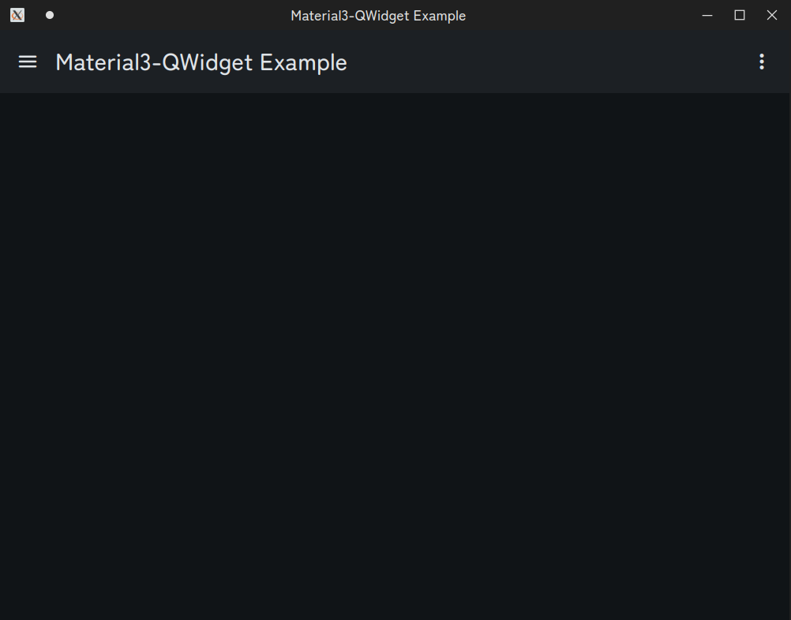

<!-- Improved compatibility of back to top link: See: https://github.com/othneildrew/Best-README-Template/pull/73 -->
<a id="readme-top"></a>
<!--
*** Thanks for checking out the Best-README-Template. If you have a suggestion
*** that would make this better, please fork the repo and create a pull request
*** or simply open an issue with the tag "enhancement".
*** Don't forget to give the project a star!
*** Thanks again! Now go create something AMAZING! :D
-->

[简体中文](./docs/readme/README.zh.md) | English

**README VERSION** 0.9.3

<!-- PROJECT SHIELDS -->
<!--
*** I'm using markdown "reference style" links for readability.
*** Reference links are enclosed in brackets [ ] instead of parentheses ( ).
*** See the bottom of this document for the declaration of the reference variables
*** for contributors-url, forks-url, etc. This is an optional, concise syntax you may use.
*** https://www.markdownguide.org/basic-syntax/#reference-style-links
-->
    


<!-- PROJECT LOGO -->
<br />

<div align="center">


  <h3 align="center">Material3-QWidget</h3>

  <p align="center">
    A Material 3 component library for Qt Widget.
    <br />
    <a href="./docs/"><strong>Explore the docs »</strong></a>
    <br />
    <br />
  </p>
</div>


<!-- TABLE OF CONTENTS -->
<details>
  <summary>Table of Contents</summary>
  <ol>
    <li>
      <a href="#about-the-project">About The Project</a>
      <ul>
        <li><a href="#built-with">Built With</a></li>
      </ul>
    </li>
    <li>
      <a href="#getting-started">Getting Started</a>
      <ul>
        <li><a href="#prerequisites">Prerequisites</a></li>
        <li><a href="#installation">Installation</a></li>
      </ul>
    </li>
    <li><a href="#usage">Usage</a></li>
    <li><a href="#roadmap">Roadmap</a></li>
    <li><a href="#license">License</a></li>
    <li><a href="#contact">Contact</a></li>
    <li><a href="#acknowledgments">Acknowledgments</a></li>
  </ol>
</details>


<!-- ABOUT THE PROJECT -->
## About The Project



Welcome to Material3-QWidget, this is my side project attempting to make a UI component library for QWidget that mimics Google's Material Design 3 Style.


Here are the feature of this library: 
* Custom palette
* Auto dark/light mode switching

<p align="right">(<a href="#readme-top">back to top</a>)</p>


### Built With

* 
* 
* 

<p align="right">(<a href="#readme-top">back to top</a>)</p>


<!-- GETTING STARTED -->

## Getting Started
You may either complie or install this library or include this project as a sub project of your CMake project as the license is compactiable.

* **If you are only introducing the `.so`/`.a`/`.dll`, etc file**: Then you may want to check out the `includes` directory as all the headers are there.
* **If you are introducing the project as a sub project of your CMake project**: Please first make sure the license is compactiable, and you may refer the code in the `examples` folder for examples of introducing this library.


### Prerequisites
To use this library, you will need these avaliable in your system: 

* **Qt**: Minimum version of 6 as we depends on `QGuiApplication::styleHints()`.

* **CMake**: Minimum version of 3.16.

### Installation

The complier may run slow as we integrated the material symbols into the `resource.qrc` file.

(Documentation working in progress)

<p align="right">(<a href="#readme-top">back to top</a>)</p>


<!-- USAGE EXAMPLES -->
## Usage
You could integrate the library using the way showed in the `examples` folder.

In the future, there will be a documentation site set up in the `docs` folder.


> The docs site is not up yet...

To read those docs, you will need to have `Node.JS` environment and `pnpm` ready in the system.

Then, at the root directory of the project, run the following command: 

```bash
cd docs
pnpm i
pnpm approve-builds
pnpm dev
```

This will pull a local server up. The default address should be at [http://localhost:5173](http://localhost:5173).

The port could change if there is another program occupying the port, the way to get the port number is to check your terminal output: 

```bash
➜  docs git:(main) ✗ pnpm dev

> m3qw.docs@ dev /home/marcus/Desktop/Repositories/Public/material3-qwidget/docs
> react-router dev

  ➜  Local:   http://localhost:5173/
  ➜  Network: use --host to expose
  ➜  press h + enter to show help
```

Hence, in the example above, the port is `5173`.

<p align="right">(<a href="#readme-top">back to top</a>)</p>


<!-- ROADMAP -->
## Roadmap
* Infras
  * [x] Theme loader
  * [x] Font loader
  * [x] Icon loader
  * [x] Default palette (will be updated while introducing new components...)
* Components
  * [ ] App bar (*Work in progress*)
  * [x] App bar Icon buttons
  * [ ] Icon buttons (*Up next*)
  * [ ] ...
* Docs
  * [x] README
  * [ ] Document site (*Planned*)
  * [ ] Example program (*Work in progress*)
* I18N
  * [ ] EN-US
  * [ ] ZH-CN

<p align="right">(<a href="#readme-top">back to top</a>)</p>


<!-- LICENSE -->
## License
* **This project** is licensed under `GNU GENERAL PUBLIC LICENSE Version 3`, for the license content, please see [COPYING](./COPYING) for details.
* **We also vendored the material symbols font**, they are licensed under `Apache License Version 2.0`, see [res/fonts/material-symbols/COPYING](./res/fonts/material-symbols/COPYING) for details.

<p align="right">(<a href="#readme-top">back to top</a>)</p>


<!-- CONTACT -->
## Contact
Please fire up an issue if you need to find me.

<p align="right">(<a href="#readme-top">back to top</a>)</p>


<!-- ACKNOWLEDGMENTS -->
## Acknowledgments
Thanks [othneildrew/Best-README-Template](https://github.com/othneildrew/Best-README-Template.git) for the README template!!

<p align="right">(<a href="#readme-top">back to top</a>)</p>
